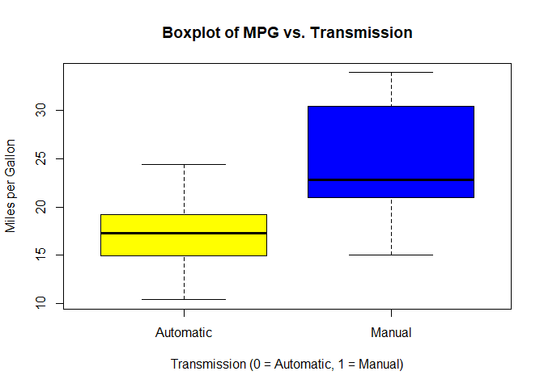
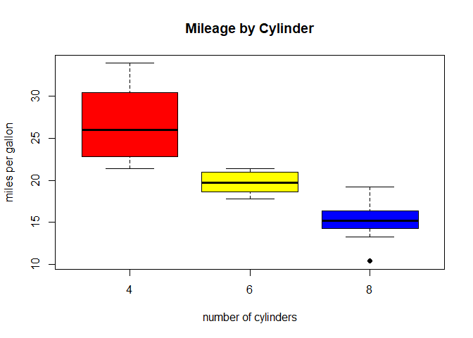
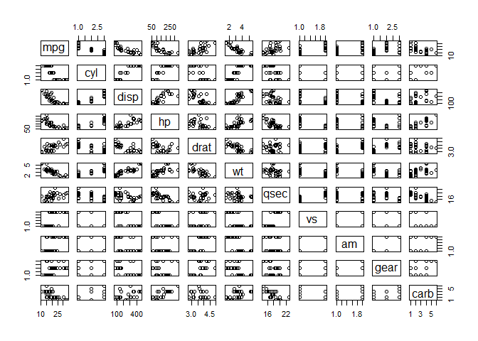

Coursera Regression Models Course Project
================
Written by: Javier Ng
4th August 2018

Executive Summary
-----------------

In this report, we will examine the `mtcars` data set and explore how miles per gallon (MPG) is affected by different variables.

Essentially, we’re asking the following question: which types of cars: manual or automatic transmission cars goes the furthest, using (mpg) as an indication.

Instructions
------------

Motor Trend, an automobile trend magazine is interested in exploring the relationship between a set of variables and miles per gallon (MPG) outcome. In this project, we will analyze the mtcars dataset from the 1974 Motor Trend US magazine to answer the following questions:

-   Is an automatic or manual transmission better for miles per gallon (MPG)?
-   How different is the MPG between automatic and manual transmissions?

Using simple linear regression analysis, we determine that there is a signficant difference between the mean MPG for automatic and manual transmission cars. Manual transmissions achieve a higher value of MPG compared to automatic transmission. This increase is approximately 2.1 MPG when switching from an automatic transmission to a manual one, with the weight, horsepower and discplacement held constant.

Exploratory analysis and visualizations are located in the Appendix to this document.

Data Codebook
-------------

We analyze the ‘mtcars’ data set through Regression Modelling and exploratory analysis to show how automatic (am = 0) and manual (am = 1) transmissions features affect the MPG feature. The dataset “mtcars” is located in the package “reshape2” first introduced in the Reshaping Data Course of the same Data Specialisation Course.

The data was extracted from the 1974 Motor Trend US magazine, which comprises fuel consumption and 10 aspects of automobile design and performance for 32 automobiles (1973-74 models).

The data set consists of a data frame with 32 observations (nrow) and 11 variables (ncol).

-   mpg: Miles per US gallon
-   cyl: Number of cylinders
-   disp: Displacement (cubic inches)
-   hp: Gross horsepower
-   drat: Rear axle ratio
-   wt: Weight (lb / 1000)
-   qsec: 1 / 4 mile time
-   vs: V/S
-   am: Transmission (0 = automatic, 1 = manual)
-   gear: Number of forward gears
-   carb: Number of carburetors

Data Processing and Transformation
----------------------------------

Loading of relevant libraries

``` r
library(ggplot2)
```

Loading of dataset

``` r
data(mtcars)
head(mtcars)
```

    ##                    mpg cyl disp  hp drat    wt  qsec vs am gear carb
    ## Mazda RX4         21.0   6  160 110 3.90 2.620 16.46  0  1    4    4
    ## Mazda RX4 Wag     21.0   6  160 110 3.90 2.875 17.02  0  1    4    4
    ## Datsun 710        22.8   4  108  93 3.85 2.320 18.61  1  1    4    1
    ## Hornet 4 Drive    21.4   6  258 110 3.08 3.215 19.44  1  0    3    1
    ## Hornet Sportabout 18.7   8  360 175 3.15 3.440 17.02  0  0    3    2
    ## Valiant           18.1   6  225 105 2.76 3.460 20.22  1  0    3    1

``` r
# Transform certain variables into factors
mtcars$cyl  <- factor(mtcars$cyl)
mtcars$vs   <- factor(mtcars$vs)
mtcars$gear <- factor(mtcars$gear)
mtcars$carb <- factor(mtcars$carb)
mtcars$am   <- factor(mtcars$am,labels=c("Automatic","Manual"))
str(mtcars)
```

    ## 'data.frame':    32 obs. of  11 variables:
    ##  $ mpg : num  21 21 22.8 21.4 18.7 18.1 14.3 24.4 22.8 19.2 ...
    ##  $ cyl : Factor w/ 3 levels "4","6","8": 2 2 1 2 3 2 3 1 1 2 ...
    ##  $ disp: num  160 160 108 258 360 ...
    ##  $ hp  : num  110 110 93 110 175 105 245 62 95 123 ...
    ##  $ drat: num  3.9 3.9 3.85 3.08 3.15 2.76 3.21 3.69 3.92 3.92 ...
    ##  $ wt  : num  2.62 2.88 2.32 3.21 3.44 ...
    ##  $ qsec: num  16.5 17 18.6 19.4 17 ...
    ##  $ vs  : Factor w/ 2 levels "0","1": 1 1 2 2 1 2 1 2 2 2 ...
    ##  $ am  : Factor w/ 2 levels "Automatic","Manual": 2 2 2 1 1 1 1 1 1 1 ...
    ##  $ gear: Factor w/ 3 levels "3","4","5": 2 2 2 1 1 1 1 2 2 2 ...
    ##  $ carb: Factor w/ 6 levels "1","2","3","4",..: 4 4 1 1 2 1 4 2 2 4 ...

Exploratory Data Analysis(EDA)
------------------------------

To help us understand the data, we build exploratory plots. In Appendix under Plot 1, it shows that there is a definite impact on MPG by transmission with Automatic transmissions having a lower MPG.

Regression Analysis
-------------------

Now that we have identified that automatic is better for MPG, a simple linear model will be used to quantify this difference. A stepwise model is developed to help select significant predictors for the final model. This step method runs ~lm multiple times and compared between these multiple regression models using both forward selection and backward elimination methods by the AIC (Akaike Information Criterion) stepwise algorithm.

``` r
firstmodel <- lm(mpg ~ ., data = mtcars)
bestmodel <- step(firstmodel, direction = "both")
```

    ## Start:  AIC=76.4
    ## mpg ~ cyl + disp + hp + drat + wt + qsec + vs + am + gear + carb
    ## 
    ##        Df Sum of Sq    RSS    AIC
    ## - carb  5   13.5989 134.00 69.828
    ## - gear  2    3.9729 124.38 73.442
    ## - am    1    1.1420 121.55 74.705
    ## - qsec  1    1.2413 121.64 74.732
    ## - drat  1    1.8208 122.22 74.884
    ## - cyl   2   10.9314 131.33 75.184
    ## - vs    1    3.6299 124.03 75.354
    ## <none>              120.40 76.403
    ## - disp  1    9.9672 130.37 76.948
    ## - wt    1   25.5541 145.96 80.562
    ## - hp    1   25.6715 146.07 80.588
    ## 
    ## Step:  AIC=69.83
    ## mpg ~ cyl + disp + hp + drat + wt + qsec + vs + am + gear
    ## 
    ##        Df Sum of Sq    RSS    AIC
    ## - gear  2    5.0215 139.02 67.005
    ## - disp  1    0.9934 135.00 68.064
    ## - drat  1    1.1854 135.19 68.110
    ## - vs    1    3.6763 137.68 68.694
    ## - cyl   2   12.5642 146.57 68.696
    ## - qsec  1    5.2634 139.26 69.061
    ## <none>              134.00 69.828
    ## - am    1   11.9255 145.93 70.556
    ## - wt    1   19.7963 153.80 72.237
    ## - hp    1   22.7935 156.79 72.855
    ## + carb  5   13.5989 120.40 76.403
    ## 
    ## Step:  AIC=67
    ## mpg ~ cyl + disp + hp + drat + wt + qsec + vs + am
    ## 
    ##        Df Sum of Sq    RSS    AIC
    ## - drat  1    0.9672 139.99 65.227
    ## - cyl   2   10.4247 149.45 65.319
    ## - disp  1    1.5483 140.57 65.359
    ## - vs    1    2.1829 141.21 65.503
    ## - qsec  1    3.6324 142.66 65.830
    ## <none>              139.02 67.005
    ## - am    1   16.5665 155.59 68.608
    ## - hp    1   18.1768 157.20 68.937
    ## + gear  2    5.0215 134.00 69.828
    ## - wt    1   31.1896 170.21 71.482
    ## + carb  5   14.6475 124.38 73.442
    ## 
    ## Step:  AIC=65.23
    ## mpg ~ cyl + disp + hp + wt + qsec + vs + am
    ## 
    ##        Df Sum of Sq    RSS    AIC
    ## - disp  1    1.2474 141.24 63.511
    ## - vs    1    2.3403 142.33 63.757
    ## - cyl   2   12.3267 152.32 63.927
    ## - qsec  1    3.1000 143.09 63.928
    ## <none>              139.99 65.227
    ## + drat  1    0.9672 139.02 67.005
    ## - hp    1   17.7382 157.73 67.044
    ## - am    1   19.4660 159.46 67.393
    ## + gear  2    4.8033 135.19 68.110
    ## - wt    1   30.7151 170.71 69.574
    ## + carb  5   13.0509 126.94 72.095
    ## 
    ## Step:  AIC=63.51
    ## mpg ~ cyl + hp + wt + qsec + vs + am
    ## 
    ##        Df Sum of Sq    RSS    AIC
    ## - qsec  1     2.442 143.68 62.059
    ## - vs    1     2.744 143.98 62.126
    ## - cyl   2    18.580 159.82 63.466
    ## <none>              141.24 63.511
    ## + disp  1     1.247 139.99 65.227
    ## + drat  1     0.666 140.57 65.359
    ## - hp    1    18.184 159.42 65.386
    ## - am    1    18.885 160.12 65.527
    ## + gear  2     4.684 136.55 66.431
    ## - wt    1    39.645 180.88 69.428
    ## + carb  5     2.331 138.91 72.978
    ## 
    ## Step:  AIC=62.06
    ## mpg ~ cyl + hp + wt + vs + am
    ## 
    ##        Df Sum of Sq    RSS    AIC
    ## - vs    1     7.346 151.03 61.655
    ## <none>              143.68 62.059
    ## - cyl   2    25.284 168.96 63.246
    ## + qsec  1     2.442 141.24 63.511
    ## - am    1    16.443 160.12 63.527
    ## + disp  1     0.589 143.09 63.928
    ## + drat  1     0.330 143.35 63.986
    ## + gear  2     3.437 140.24 65.284
    ## - hp    1    36.344 180.02 67.275
    ## - wt    1    41.088 184.77 68.108
    ## + carb  5     3.480 140.20 71.275
    ## 
    ## Step:  AIC=61.65
    ## mpg ~ cyl + hp + wt + am
    ## 
    ##        Df Sum of Sq    RSS    AIC
    ## <none>              151.03 61.655
    ## - am    1     9.752 160.78 61.657
    ## + vs    1     7.346 143.68 62.059
    ## + qsec  1     7.044 143.98 62.126
    ## - cyl   2    29.265 180.29 63.323
    ## + disp  1     0.617 150.41 63.524
    ## + drat  1     0.220 150.81 63.608
    ## + gear  2     1.361 149.66 65.365
    ## - hp    1    31.943 182.97 65.794
    ## - wt    1    46.173 197.20 68.191
    ## + carb  5     5.633 145.39 70.438

The best model obtained from the above computations consists of the variables, **wt**, **cyl**, **wt** and **am**. Details of the model are depicted below.

``` r
summary(bestmodel)
```

    ## 
    ## Call:
    ## lm(formula = mpg ~ cyl + hp + wt + am, data = mtcars)
    ## 
    ## Residuals:
    ##     Min      1Q  Median      3Q     Max 
    ## -3.9387 -1.2560 -0.4013  1.1253  5.0513 
    ## 
    ## Coefficients:
    ##             Estimate Std. Error t value Pr(>|t|)    
    ## (Intercept) 33.70832    2.60489  12.940 7.73e-13 ***
    ## cyl6        -3.03134    1.40728  -2.154  0.04068 *  
    ## cyl8        -2.16368    2.28425  -0.947  0.35225    
    ## hp          -0.03211    0.01369  -2.345  0.02693 *  
    ## wt          -2.49683    0.88559  -2.819  0.00908 ** 
    ## amManual     1.80921    1.39630   1.296  0.20646    
    ## ---
    ## Signif. codes:  0 '***' 0.001 '**' 0.01 '*' 0.05 '.' 0.1 ' ' 1
    ## 
    ## Residual standard error: 2.41 on 26 degrees of freedom
    ## Multiple R-squared:  0.8659, Adjusted R-squared:  0.8401 
    ## F-statistic: 33.57 on 5 and 26 DF,  p-value: 1.506e-10

From the above, we observe that the Adjusted R^2 value is 0.84 which is the maximum obtained considering all combinations of variables. Thus, we can conclude that more than 84% of the variability is explained by the above model.

Next, we use anova to compare against our base model, that only uses am as a predictor variable, and the best model that was found through performing stepwise selection.

``` r
basemodel <- lm(mpg ~ am, data = mtcars)
anova(basemodel, bestmodel)
```

    ## Analysis of Variance Table
    ## 
    ## Model 1: mpg ~ am
    ## Model 2: mpg ~ cyl + hp + wt + am
    ##   Res.Df    RSS Df Sum of Sq      F    Pr(>F)    
    ## 1     30 720.90                                  
    ## 2     26 151.03  4    569.87 24.527 1.688e-08 ***
    ## ---
    ## Signif. codes:  0 '***' 0.001 '**' 0.01 '*' 0.05 '.' 0.1 ' ' 1

As p-value is significant, hence we reject the null hypothesis that the variables **wt**, **hp** and **cyl** do not contribute to the accuracy of the model.

Residual and Diagnostics
------------------------

we examine residual plots of our regression model and also compute some of the regression diagnostics of our model to uncover outliers in the data set.

``` r
par(mfrow = c(2,2))
plot(bestmodel)
```


Here are the following observations from the above plots:

-   For the Residuals vs. Fitted plot seem to be randomly scattered on the plot and verify the independence condition.
-   The Normal Q-Q plot consists of the points which mostly fall on the line indicating that the residuals are normally distributed.
-   The Scale-Location plot consists of points scattered in a constant band pattern, indicating constant variance.
-   There are some distinct points of interest (outliers or leverage points) in the top right of the plots.

Conclusion
----------

In conclusion, Manual transmission cars get more miles per gallon against cars with Automatic transmission.

Appendix
--------

Boxplot of MPG vs. Transmission

``` r
boxplot(mpg ~ am, data=mtcars, col=(c("yellow","blue")), xlab="Transmission (0 = Automatic, 1 = Manual)", ylab="Miles per Gallon", main="Boxplot of MPG vs. Transmission")
```



Boxplot of Mileage by Cylinder

``` r
boxplot(mtcars$mpg ~ mtcars$cyl, data=mtcars, outpch = 19, col=(c("red", "yellow", "blue")), ylab="miles per gallon", xlab="number of cylinders", main="Mileage by Cylinder")
```



Scatter plot matrix for mtcars dataset

``` r
pairs(mpg ~., mtcars)
```


